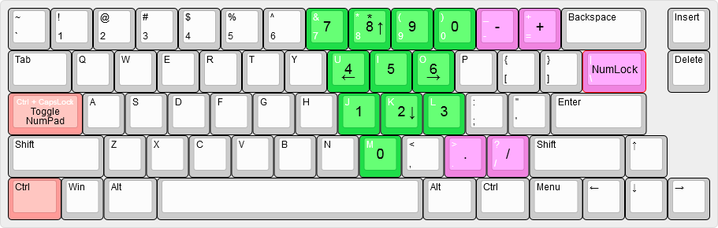

# CapslockNumpad

An Autohotkey script for Windows that lets you emulate a numeric keypad (numpad) on a keyboard that doesn't have it. Both NumLock modes are usable.

## Operation

Extract `CapslockNumpad.exe`, `numpad_red.ico`, and `numpad_green.ico` to anywhere on your computer. Run `CapslockNumpad.exe`. The executable does not write anything to your computer.

Press `Ctrl + CapsLock` to toggle the numpad on and off. Press `\` (above the `Enter` key) to toggle NumLock.

The source code is in the `/src/` directory of this repo if you want to edit the script.

The tray icon for CapslockNumpad changes colour to indicate the state of the numpad (red for disabled, green for enabled). I recommend setting this icon to always be visible in the tray (in Windows 10: Right-click the taskbar → Taskbar settings → Notification area → Select with icons appear on the taskbar).

## Acknowledgements

- Numpad tray icon by Kirby Wu from the Noun Project <https://thenounproject.com/search/?q=numpad&i=686166>
- Keyboard layout diagram from <http://www.keyboard-layout-editor.com>
- Base code from [/u/GroggyOtter](https://www.reddit.com/r/AutoHotkey/comments/abyg9b/help_script_for_emulated_numpad_function/)
